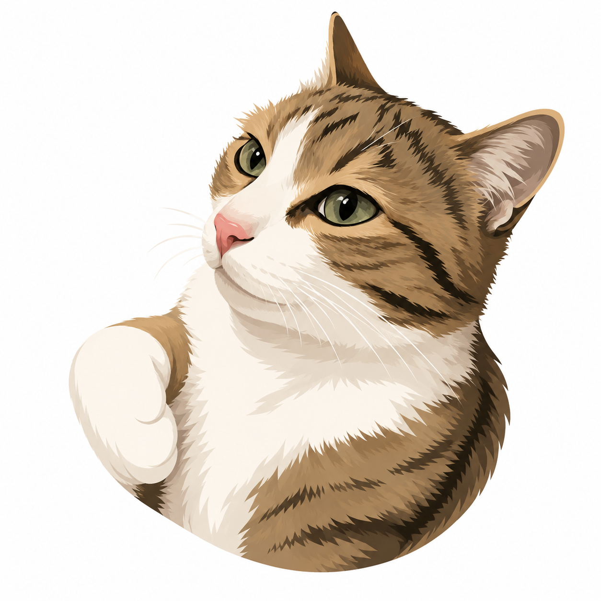

# Styxpress

<p align="center">
  
</p>

Styxpress is a local static blog generator with a small Go admin server and a
Vue admin UI. Source content stays on the user's computer. Styxpress renders
HTML, feeds, sitemap, media, and a single built-in stylesheet into a local
`public/` output folder.

The public blog is static. Serve the generated `public/` directory with Caddy,
Nginx, another static file server, or any separate deployment/sync tool.
Styxpress does not upload files to a remote server.

## Current Scope

Included:

- Local content folders.
- Local public output folders.
- Markdown posts stored as files.
- Draft and published post states.
- Local preview and render.
- One clean public stylesheet.
- Site title and description.
- Generated favicon with optional `.ico` replacement.
- Header links.
- Footer text and footer links.
- Footer watermark toggle for `Published with Styxpress`.
- RSS feed and sitemap output.

Removed from the first release:

- SSH/SFTP publishing.
- Server-backed content storage.
- Featured posts.
- Theme presets.
- Custom CSS editing.
- Saved themes.
- Remote verification.

## Content Layout

Source content lives under the configured `contentDir`:

```text
content/
  site.toml
  assets/
    brand.ico
  posts/
    hello-world/
      source.md
      title.txt
      description.txt
      published_at.txt
      updated_at.txt
      cover.jpg
      assets/
```

Generated output lives under the configured `publicDir`:

```text
public/
  favicon.ico
  index.html
  feed.xml
  sitemap.xml
  assets/
    styxpress.css
    brand.ico
  posts/
    hello-world/
      index.html
      cover.jpg
      assets/
```

No Markdown parsing, database query, or application server is required for
normal public page views.

## Build And Run

From the repository root:

```bash
cd admin/web
npm install
npm run build
cd ../..

go build -o styxpress-admin ./cmd/styxpress-admin
./styxpress-admin
```

The command prints a local admin URL:

```text
styxpress-admin listening on http://127.0.0.1:42317
```

Open that URL in your browser.

To use a fixed local port:

```bash
./styxpress-admin -addr 127.0.0.1:8080
```

The admin server binds to `127.0.0.1` by default.

## Workflow

1. Create or open a site from **My sites**. New sites get a normalized unique
   site id and default folders under `~/Styxpress/<site-id>/`.
2. In **Configuration**, set:
   - `contentDir`: local source content directory.
   - `publicDir`: local generated output directory.
3. In **Site**, edit:
   - title
   - description
   - favicon
   - header links
   - footer text
   - footer links
   - watermark visibility
   The preview updates while editing. **Save** writes `site.toml` and renders
   the public site.
4. In **Posts**, choose an existing post from the list or create a new one.
5. Use **Preview** for draft HTML previews without writing public files.
6. Use **Save** to write the post, mark it as published, and render the public
   output locally.

## Site Config

`site.toml` is stored in `contentDir`:

```toml
title = "My Blog"
description = "Latest posts"

[header]

[[header.links]]
label = "Home"
href = "/"

[[header.links]]
label = "RSS"
href = "/feed.xml"

[footer]
text = "Local notes."
showWatermark = true

[[footer.links]]
label = "RSS"
href = "/feed.xml"
```

## Local Output

After rendering, inspect:

```text
site/public/index.html
site/public/feed.xml
site/public/sitemap.xml
site/public/posts/hello-world/index.html
```

## Development Commands

```bash
go test ./...
go build -o styxpress-admin ./cmd/styxpress-admin

cd admin/web
npm install
npm run dev
npm run build
```

The frontend production build is expected at
`cmd/styxpress-admin/web/dist` for embedding by the Go binary. Do not commit
generated `dist` output unless explicitly requested.
